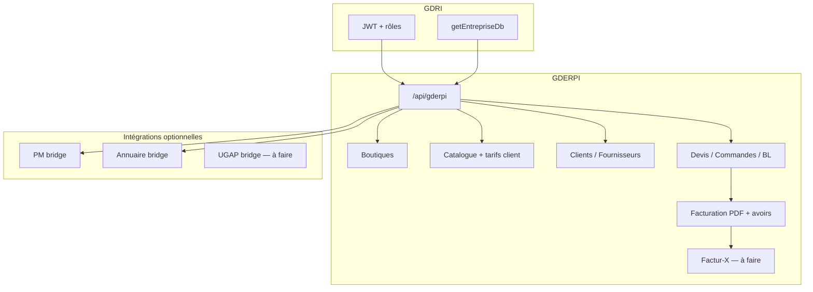

# GDERPI — plan de développement

> **Nom visible GDRI** : **GDERPI**  
> **Identifiant technique** : module `gderpi` — routes `/api/gderpi/*`  
> **Méthode** : décrire chaque fonction → **validation** → **1 fonction = 1 fichier** → coder → tester.  
> **Dernière mise à jour plan** : juin 2026

**Indépendance** : module autonome. UGAP (bateaux) pourra être relié plus tard via `integrations/ugap-bridge/` — hors périmètre initial.

Statut par fonction : `⬜ à décrire` | `📝 à valider` | `✅ validé` | `💻 codé` | `🧪 testé OK`

---

## Vision

Mini ERP commercial multi-boutique :

- Plusieurs **boutiques** par entreprise GDRI (marques, SIRET, identité distincte).
- **Catalogue maître** produits + services ; tarifs **par client** (`refsClient`) — alias par boutique reporté (voir backlog).
- **Clients** et **fournisseurs**.
- Workflow : **devis → commande client → commande fournisseur → livraison → facturation**.
- **Devis PDF** puis **facturation électronique** (Factur-X + envoi API État / PDP) — phase ultérieure.

---

## État actuel (juin 2026)

Le parcours commercial principal est **opérationnel** :

| Domaine | Backend | Frontend | Statut |
|---------|---------|----------|--------|
| Fondations (middleware, health, JWT) | 💻 | — | OK |
| Boutiques + CGV + conditions vente | 💻 | 💻 | OK |
| Catégories (nœuds) + articles + unités | 💻 | 💻 | OK |
| Clients + fournisseurs + services clients | 💻 | 💻 | OK |
| Devis (CRUD, PDF, envoi, acceptation publique) | 💻 | 💻 | OK |
| Commandes client + workflow GDRI | 💻 | 💻 | OK |
| Commandes fournisseur + réception partielle | 💻 | 💻 | OK |
| Bons de livraison partiels | 💻 | 💻 | OK |
| Recette prestation (partielle par lignes) | 💻 | 💻 | OK |
| Facturation partielle + multi-factures | 💻 | 💻 | OK |
| Avoir total | 💻 | 💻 | OK |
| Avoir partiel | 💻 | 💻 | OK |
| Dashboard KPIs + tâches | 💻 | 💻 | OK |
| Mail (comptes, modèles, envoi documents) | 💻 | 💻 | OK |
| Intégration PM (lien carte, sync devis) | 💻 | 💻 | OK |
| Intégration Annuaire (lien obligatoire) | 💻 | 💻 | OK |
| Factur-X / e-facture | ⬜ | ⬜ | Non démarré |
| Pont UGAP | ⬜ | ⬜ | Non démarré |

**Point d'entrée UI** : `frontend/pages/modules/gderpi.php` (shell unique : app + configuration).

**Arborescence réelle** : `modules/gderpi/backend/services/` (boutiques, articles, clients, devis, commande-client, commande-fournisseur, bon-livraison, facturation, pdf, mail, …) + `modules/gderpi/frontend/assets/js/`.

---

## Backlog — points à voir (priorisé)

| # | Sujet | Priorité | Statut | Notes |
|---|-------|----------|--------|-------|
| 1 | **Avoir partiel — UI** | Haute | 💻 | Modale `#gderpi-avoir-modal` + bouton onglet Facturation |
| 2 | **Pont Annuaire bidirectionnel** | Haute | 💻 | Lien obligatoire, sync contacts, import backfill (clients, fournisseurs, **boutiques internes**) |
| 3 | **Expiration auto devis** | Moyenne | ⬜ | `dateValidite` calculée ; statut `expire` manuel ; pas de cron/relance |
| 4 | **Factur-X + connecteur e-facture** (Phase 6) | Moyenne | ⬜ | Choix connecteur à trancher (Mock / Chorus / PDP) |
| 5 | **Alias catalogue par boutique** | Basse | ⬜ | Remplacé partiellement par `refsClient` ; à trancher si besoin réel |
| 6 | **Paramétrage numérotation** | Basse | ⬜ | Séquences backend OK ; pas d'UI préfixes/format |
| 7 | **Rapports / export compta** | Basse | ⬜ | CA, marges, CSV/FEC |
| 8 | **Pont UGAP** (Phase 7) | Basse | ⬜ | `integrations/ugap-bridge/` |
| 9 | **Stock global / inventaire** | Reporté | ⬜ | Volontairement : `gestionStock` + suivi par ligne commande |
| 10 | **Tests automatisés** | Basse | ⬜ | Aucun test module |
| 11 | **README.md** | Basse | ⬜ | Installation / démarrage |
| 12 | **Mise à jour continue PLAN.md** | — | 💻 | Ce fichier |

### Ordre de travail recommandé (suite)

1. Avoir partiel UI → tester sur facture multi-lignes.
2. Pont Annuaire GDERPI (symétrie avec module annuaire).
3. Expiration auto + relances devis (tâche planifiée GDRI).
4. Phase 6 Factur-X (après choix connecteur).
5. Phase 7 pont UGAP si besoin métier.

---

## Phasage

| Phase | Périmètre | Statut |
|-------|-----------|--------|
| **0** | Squelette module, middleware, health | 💻 codé |
| **MVP** | Nœuds catégories + articles + clients + fournisseurs | 💻 codé |
| **1** | Boutiques + paramétrage backoffice | 💻 codé |
| **2** | Catalogue (articles, unités, tarifs client) | 💻 codé — alias boutique ⬜ |
| **3** | Tiers clients / fournisseurs | 💻 codé |
| **4** | Devis (CRUD, lignes, PDF, envoi, acceptation) | 💻 codé |
| **5** | Workflow commandes + BL + facturation + avoirs | 💻 codé |
| **5b** | Livraison / réception fournisseur (extension) | 💻 codé — voir § Livraison |
| **6** | Factur-X + connecteur API | ⬜ |
| **7** | Pont UGAP optionnel | ⬜ |
| **8** | Intégrations PM + Annuaire | 💻 | Annuaire lié obligatoirement |

---

## Architecture



### Arborescence cible

```
modules/gderpi/
├── CONVENTIONS.md
├── README.md                      ← à créer
├── docs/
│   ├── PLAN.md                    ← ce fichier
│   └── DESIGN.md
├── backend/
│   ├── routes.js
│   ├── controllers/
│   ├── middleware/
│   ├── integrations/              ← pm-bridge ; ugap-bridge (à faire)
│   └── services/                  ← 1 fonction / fichier
└── frontend/
    └── assets/js/                 ← onglets gderpi.php
```

---

## Collections Mongo (base entreprise)

| Collection | Rôle |
|------------|------|
| `gderpi_boutiques` | Boutiques (paramétrage, légal, CGV) |
| `gderpi_nodes_state` | Nœuds catalogue `nodes[]` + `tagRegistry[]` |
| `gderpi_articles` | Produits et services + `refsClient` + fournisseurs |
| `gderpi_clients` | Clients |
| `gderpi_fournisseurs` | Fournisseurs |
| `gderpi_unites` | Unités de mesure |
| `gderpi_client_services` | Services / contacts entreprise |
| `gderpi_devis` | Devis + lignes + statut + historique |
| `gderpi_commandes_client` | Commandes clients + factures + avoirs embarqués |
| `gderpi_commandes_fournisseur` | Commandes fournisseurs |
| `gderpi_bons_livraison` | Bons de livraison |
| `gderpi_sequences` | Compteurs numérotation par boutique |
| `gderpi_public_links` | Liens publics documents / acceptation devis |
| `gderpi_mail_settings` | Paramètres e-mail module |
| `gderpi_einvoicing_log` | Journal envois API facturation — **à créer** |

---

## Phases codées — résumé routes principales

Voir `backend/routes.js` pour la liste complète.

| Domaine | Routes clés | Statut |
|---------|-------------|--------|
| Health | `GET /health` | 💻 |
| Boutiques | `GET/POST/PUT/DELETE /boutiques` | 💻 |
| Catalogue | `/nodes`, `/articles`, `/unites` | 💻 |
| Tiers | `/clients`, `/fournisseurs`, `/client-services` | 💻 |
| Devis | `/devis`, `/devis/:id/pdf`, `/devis/:id/send`, `/devis/:id/to-commande-client` | 💻 |
| Commandes client | `/commandes-client`, workflow, BL, facturation, avoirs | 💻 |
| Commandes fournisseur | `/commandes-fournisseur`, réception | 💻 |
| Public | `/public/devis|facture|avoir|…/:entrepriseId/…` | 💻 |
| Mail | `/settings/mail`, `/mail/contacts` | 💻 |
| PM | `/integrations/pm/status`, `/integrations/pm/cards` | 💻 |
| Dashboard | `GET /dashboard` | 💻 |

### Statuts devis

`brouillon` → `envoye` → `accepte` | `refuse` | `expire`

### Numérotation séquences

Types : `devis` (DEV), `commande_client` (CMD), `commande_fournisseur` (CF), `facture` (FAC), `avoir` (AVO), `bon_livraison` (BL) — format `{PREFIX}-{ANNEE}-{0000}`.

---

## Phase 6 — Facturation électronique (à faire)

| Fichier | Rôle | Statut |
|---------|------|--------|
| `services/einvoicing/validateLegalFields.js` | SIRET, TVA, mentions | ⬜ |
| `services/einvoicing/buildCiiXml.js` | XML CII | ⬜ |
| `services/einvoicing/buildFacturX.js` | PDF/A-3 + XML embarqué | ⬜ |
| `services/einvoicing/logEinvoicingAttempt.js` | Journal Mongo | ⬜ |
| `services/einvoicing/connectors/MockConnector.js` | Dev / tests | ⬜ |
| `services/einvoicing/connectors/ChorusProConnector.js` | B2G | ⬜ |
| `services/einvoicing/sendDocument.js` | Connecteur boutique | ⬜ |
| `controllers/einvoicingController.js` | Handlers HTTP | ⬜ |

### Routes Phase 6

| Route | Statut |
|-------|--------|
| `POST /commandes-client/:id/factures/:factureId/einvoicing/validate` | ⬜ |
| `POST /commandes-client/:id/factures/:factureId/einvoicing/send` | ⬜ |
| `GET /einvoicing/log` | ⬜ |

---

## Phase 7 — Intégration UGAP (optionnel)

| Fichier | Rôle | Statut |
|---------|------|--------|
| `integrations/ugap-bridge/mapUgapDevisToGderpi.js` | Devis bateau → devis GDERPI | ⬜ |
| `integrations/ugap-bridge/importUgapClient.js` | Client UGAP → client GDERPI | ⬜ |

**Règle** : seul ce dossier peut importer depuis `modules/ugap/`.

---

## Avoir partiel

### Backend (codé)

| Fonction | Fichier | Statut |
|----------|---------|--------|
| `creerAvoirSurFacture` | `commande-client/creerAvoirSurFacture.js` | 💻 |
| `resolveAvoirSelections` | `facturation/resolveAvoirSelections.js` | 💻 |
| `listLignesAvoirables` | `facturation/listLignesAvoirables.js` | 💻 |

Payload API : `{ lignes: [{ id, quantite }] }` ou `{ mode: 'complet' }`.

Route : `POST /commandes-client/:id/factures/:factureId/avoir`

### Frontend

| Fichier | Rôle | Statut |
|---------|------|--------|
| `bindAvoirModal.js` | Modale avoir partiel + avoir total | 💻 |
| `bindFacturationTab.js` | Boutons « Avoir partiel » / « Avoir total » | 💻 |
| `gderpi.php` | HTML modale `#gderpi-avoir-modal` | 💻 |

---

## Décisions ouvertes

| Sujet | Options | Décision |
|-------|---------|----------|
| Génération PDF | Puppeteer | ✅ Puppeteer (`htmlToPdfBuffer.js`) |
| Connecteur e-facture MVP | Mock + Chorus / PDP nommé | ⬜ |
| Suppression boutique | Hard delete vs `actif: false` | ⬜ |
| Stock produits | Stock global vs suivi par ligne | ✅ `gestionStock` + qty par ligne commande |
| Recette service partielle | Ligne complète vs % | ✅ partielle par sélection de lignes dev |
| Alias boutique vs tarifs client | Les deux / tarifs client seuls | ⬜ tarifs client en prod ; alias boutique backlog |

---

## Livraison client — disponibilité après réception fournisseur

> **Décision validée** : BL produit prérempli avec la quantité livrable (reçue frs − déjà livrée client), saisie manuelle conservée avec alerte si dépassement.

### Données ligne commande

| Champ | Rôle |
|-------|------|
| `quantite` | Qté commandée |
| `quantiteRecueFrs` | Cumul reçu fournisseur pour cette ligne |
| `quantiteLivree` | Cumul livré client (BL) |
| `quantiteLivrable` | **Calculé API** : `min(reste commandé, max(0, quantiteRecueFrs − quantiteLivree))` si achat frs requis ; sinon `reste commandé` |

### Fonctions — livraison / réception

| Fonction | Fichier | Statut |
|----------|---------|--------|
| `lineRequiresReceptionFrs` | `workflow/lineRequiresReceptionFrs.js` | 💻 |
| `resolveQuantiteLivrable` | `workflow/resolveQuantiteLivrable.js` | 💻 |
| `effectiveQuantiteRecueFrs` | `workflow/effectiveQuantiteRecueFrs.js` | 💻 |
| `creditQuantiteRecueFrsFromCf` | `commande-client/creditQuantiteRecueFrsFromCf.js` | 💻 |
| `rebuildQuantiteRecueFrsFromCfs` | `commande-client/rebuildQuantiteRecueFrsFromCfs.js` | 💻 |
| `isCommandeEligibleBonLivraison` | `workflow/isCommandeEligibleBonLivraison.js` | 💻 |
| `enrichLignesWithQuantiteLivrable` | `commande-client/enrichLignesWithQuantiteLivrable.js` | 💻 |
| `createBonLivraison` | `bon-livraison/createBonLivraison.js` | 💻 |
| `enregistrerReceptionFournisseur` | `commande-fournisseur/enregistrerReceptionFournisseur.js` | 💻 |
| `enregistrerReceptionFournisseurCommande` | `commande-client/enregistrerReceptionFournisseurCommande.js` | 💻 |

### Règles métier BL

1. Réception CF (`recue`) → crédit qty CF sur lignes commande client (répartition par `articleId`).
2. Modale BL : colonnes **Reste cmd** · **Dispo** · **Qté livrée** ; préremplissage = dispo.
3. Dépassement dispo : alerte frontend + `forceDepassement: true` ; plafond dur = reste commandé.
4. Commande sans achats frs : dispo = reste commandé.
5. Recette service/dev : validation par **sélection de lignes** (partielle possible).

### Frontend livraison

| Fichier | Rôle | Statut |
|---------|------|--------|
| `commandeClientHelpers.js` | `livrableQty`, colonnes suivi | 💻 |
| `bindBonLivraisonEditor.js` | Modale BL partiel | 💻 |
| `bindReceptionFournisseurModal.js` | Réception CF | 💻 |
| `bindRecetteModal.js` | Livraison prestation | 💻 |
| `bindCommandeClientEditor.js` | Suivi livraison lecture | 💻 |

---

## Références GDRI (lecture avant code)

- `modules/gderpi/CONVENTIONS.md` — règles module
- `modules/gderpi/docs/DESIGN.md` — guide UI
- `backend/core/module-loader.js` — chargement modules
- `modules/banque/backend/` — module léger de référence
- `modules/annuaire/backend/services/integrations/gderpi/` — pont annuaire existant
